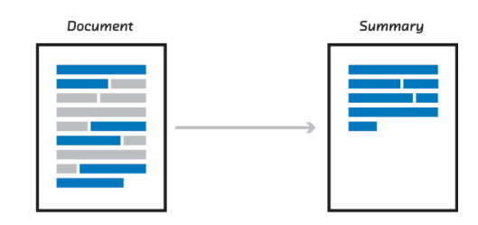

<!--
*** Thanks for checking out this README Template. If you have a suggestion that would
*** make this better, please fork the repo and create a pull request or simply open
*** an issue with the tag "enhancement".
*** Thanks again! Now go create something AMAZING! :D
-->

<!-- PROJECT SHIELDS -->
<!--
*** I'm using markdown "reference style" links for readability.
*** Reference links are enclosed in brackets [ ] instead of parentheses ( ).
*** See the bottom of this document for the declaration of the reference variables
*** for contributors-url, forks-url, etc. This is an optional, concise syntax you may use.
*** https://www.markdownguide.org/basic-syntax/#reference-style-links
-->
<!-- [![Contributors][contributors-shield]][contributors-url]
[![Forks][forks-shield]][forks-url]
[![Stargazers][stars-shield]][stars-url]
[![Issues][issues-shield]][issues-url]
[![MIT License][license-shield]][license-url]
[![LinkedIn][linkedin-shield]][linkedin-url] -->


<!-- PROJECT LOGO -->
<br />
<p align="center">
  <a href="https://github.com/Shandilya21/extractive_summarization">
    
  </a>

  <h3 align="center">Extractive Summarization Using Stacked RNN</h3>
<!-- 
  <p align="center">
    An awesome README template to jumpstart your projects!
    <br />
    <a href="https://github.com/othneildrew/Best-README-Template"><strong>Explore the docs »</strong></a>
    <br />
    <br />
    <a href="https://github.com/othneildrew/Best-README-Template">View Demo</a>
    ·
    <a href="https://github.com/othneildrew/Best-README-Template/issues">Report Bug</a>
    ·
    <a href="https://github.com/othneildrew/Best-README-Template/issues">Request Feature</a>
  </p>
</p>

 -->

<!-- TABLE OF CONTENTS -->
## Table of Contents

* [About the Project](#about-the-project)
  * [Built With](#built-with)
* [Getting Started](#getting-started)
  * [Prerequisites](#prerequisites)
  * [Installation](#installation)
* [Usage](#usage)
* [Roadmap](#roadmap)
* [Contributing](#contributing)
* [Contact](#contact)

<!-- ABOUT THE PROJECT -->
## About The Project

<!-- [![Product Name Screen Shot][product-screenshot]] -->
The approaches to text summarization vary depending on the number of input documents (single or multiple), purpose (generic, domain specific, or query-based) and output (extractive or abstractive).

Extractive summarization means identifying important sections of the text and generating them verbatim producing a subset of the sentences from the original text; while abstractive summarization reproduces important material in a new way after interpretation and examination of the text using advanced natural language techniques to generate a new shorter text that conveys the most critical information from the original one.

Why we need this?
* A summary is meant to inform your reader—who has not read the text or seen the presentation—of what the text is about. It describes its purpose or main idea, and summarizes the supporting arguments that develop that idea.


### Built With
* [Python](https://www.python.org/)
* [Keras](https://keras.io/)
* [Scikit-Learn](https://scikit-learn.org/)


<!-- GETTING STARTED -->
## Getting Started
Below the the basic step to reproduce the code with few commands.

1. Clone the repository
```
git clone https://github.com/Shandilya21/extractive_summarization.git
```

### Prerequisites
```
pip install -r requirement.txt
```
Before performing experiments, SET the config for the data path. In ```config.py``` Change the **DATA_PATH** to your data path location.

**Dataset**: Data can be downloaded from here [**(Dataset)**](https://drive.google.com/file/d/0B7FKpaFOwrQ4NUJkRWNBYW9HMUhRQThCVmRkMHVWenpvQU1z/view) and [**(Dataset)**](https://drive.google.com/file/d/0B7FKpaFOwrQ4MXhlaHplbTdTRVdpYmJ2bjlvVWhUNGUxalJ3/view) Create and place the data inside the data/train folder. You may also create the test set to check the performance of the model from the split )(deifned in code).

**Embeddings**: Download the pretrained weights from here [GloVe](http://nlp.stanford.edu/data/glove.840B.300d.zip). save the file inside the ```data/embeddings/glove```. if not feel free to save anywhere.

Before performing further steps, SET the config for the data path. In ```config.py``` Change the **DATA_PATH** to your data path location.

<!-- USAGE EXAMPLES -->
## Usage

This repo are for 3 word window and 5 word window architecture text summarization (extractive methods), Also you can produce results for similar hparams. The default number of epochs = 5. Feel free to set the epochs from ```run.sh```. 

```
chmod +x run.sh
bash run.sh   
```
## Results

|Model | Ratio | Acc   |
|------|-------|-------|   
|  1   |  0.31 | 71.24 |
|  3   |  0.37 | 77.88 |
|  5   |  0.41 | 80.08 |


<!-- ROADMAP -->
## Roadmap

See the [open issues](https://github.com/Shandilya21/extractive_summarization/issues) for a list of proposed features (and known issues). Also, if you have any issue, feel free to open a new issue.

<!-- CONTRIBUTING -->
## Contributing

Contributions are what make the project such an amazing place to be learn, inspire, and create. Any contributions you make are **greatly appreciated**.

1. Fork the Project
2. Create your Feature Branch (`git build -b build/newfeature`)
3. Commit your Changes (`git commit -m 'Add some newfeature'`)
4. Push to the Branch (`git push origin build/newfeature`)
5. Open a Pull Request

<!-- LICENSE -->
<!-- ## License

Distributed under the MIT License. See `LICENSE` for more information.
 -->


<!-- CONTACT -->
## Contact
Arunav Shandilya - arunavshandilya96@gmail.com

<!-- Project Link: [https://github.com/your_username/repo_name](https://github.com/your_username/repo_name) -->


<!-- ACKNOWLEDGEMENTS
## Acknowledgements
* [GitHub Emoji Cheat Sheet](https://www.webpagefx.com/tools/emoji-cheat-sheet)
* [Img Shields](https://shields.io)
* [Choose an Open Source License](https://choosealicense.com)
* [GitHub Pages](https://pages.github.com)
* [Animate.css](https://daneden.github.io/animate.css)
* [Loaders.css](https://connoratherton.com/loaders)
* [Slick Carousel](https://kenwheeler.github.io/slick)
* [Smooth Scroll](https://github.com/cferdinandi/smooth-scroll)
* [Sticky Kit](http://leafo.net/sticky-kit)
* [JVectorMap](http://jvectormap.com)
* [Font Awesome](https://fontawesome.com)
 -->


<!-- MARKDOWN LINKS & IMAGES -->
<!-- https://www.markdownguide.org/basic-syntax/#reference-style-links -->
<!-- [contributors-shield]: https://img.shields.io/github/contributors/othneildrew/Best-README-Template.svg?style=flat-square
[contributors-url]: https://github.com/othneildrew/Best-README-Template/graphs/contributors
[forks-shield]: https://img.shields.io/github/forks/othneildrew/Best-README-Template.svg?style=flat-square
[forks-url]: https://github.com/Shandilya21/stock_movement_prediction/network/members
[stars-shield]: https://img.shields.io/github/stars/othneildrew/Best-README-Template.svg?style=flat-square
[stars-url]: https://github.com/othneildrew/Best-README-Template/stargazers
[issues-shield]: https://img.shields.io/github/issues/othneildrew/Best-README-Template.svg?style=flat-square
[issues-url]: https://github.com/othneildrew/Best-README-Template/issues
[license-shield]: https://img.shields.io/github/license/othneildrew/Best-README-Template.svg?style=flat-square
[license-url]: https://github.com/othneildrew/Best-README-Template/blob/master/LICENSE.txt
[linkedin-shield]: https://img.shields.io/badge/-LinkedIn-black.svg?style=flat-square&logo=linkedin&colorB=555
[linkedin-url]: https://linkedin.com/in/othneildrew
[product-screenshot]: plot/predicted_stock_price.png
 -->